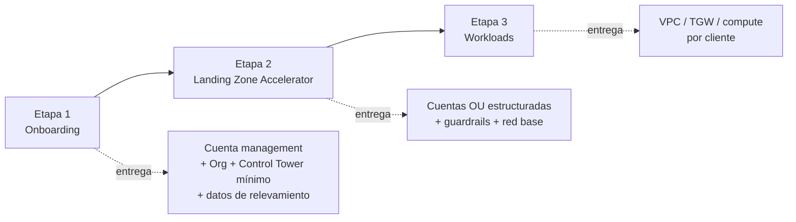

# Metodología de despliegue de Landing Zone

## Objetivo

Estandarizar el proceso completo de puesta en marcha de una AWS Organization nueva para un cliente, desde el primer contacto hasta que las cargas de trabajo están corriendo, de forma que:

- Sea repetible entre clientes (mismo checklist, mismos scripts base).
- Quede documentado para poder entregarle al cliente un artefacto claro de "qué se desplegó y por qué".
- Minimice trabajo manual no versionado.

## Las 3 etapas

### Etapa 1 — Onboarding

**Naturaleza:** mayormente manual. Es la etapa donde se recopila información y se toman decisiones que van a condicionar todo lo que sigue.

**Entradas:** cliente nuevo, kickoff con el cliente.

**Actividades:**
1. Relevamiento de información (ver [`01-onboarding/01-relevamiento.md`](01-onboarding/01-relevamiento.md)).
2. Definición de convención de emails y creación de la cuenta AWS management (payer account).
3. Baseline de seguridad manual/scriptado: MFA en root, budgets & alarms, configuración inicial de Organizations.
4. Configuración de Control Tower con el mínimo necesario (home region, OUs base, CloudTrail org, Identity Center).

**Salida:** una AWS Organization con cuenta management asegurada, Control Tower activo, y un documento de relevamiento completo que alimenta la Etapa 2.

### Etapa 2 — Landing Zone Accelerator (LZA)

**Naturaleza:** configuración declarativa. Se traduce la información relevada en la Etapa 1 a los archivos de configuración de LZA.

**Herramienta:** [Landing Zone Accelerator on AWS](https://awslabs.github.io/landing-zone-accelerator-on-aws/latest/) — solución de AWS Labs basada en CDK, mantenida por AWS, que aplica buenas prácticas de landing zone (guardrails, SCPs, red centralizada, logging, cuentas por OU).

**Actividades:**
1. Instalación de LZA en la cuenta management (pipeline CodePipeline/CodeBuild que AWS provee).
2. Completar los archivos de configuración (`accounts-config.yaml`, `organization-config.yaml`, `security-config.yaml`, `network-config.yaml`, `global-config.yaml`, `iam-config.yaml`) con los datos del relevamiento.
3. Ejecutar el pipeline y validar el despliegue.

**Salida:** estructura de OUs y cuentas final, guardrails de seguridad, red centralizada (Transit Gateway / IPAM si aplica a nivel org), logging centralizado.

Detalle en [`docs/02-landing-zone-accelerator/README.md`](02-landing-zone-accelerator/README.md).

### Etapa 3 — Workloads

**Naturaleza:** Infraestructura como código por cliente/carga de trabajo, ya con las cuentas creadas.

**Herramienta:** Terraform.

**Actividades:** VPC de la carga de trabajo, peering/attachment al Transit Gateway central, subredes, balanceadores, servidores, etc.

**Salida:** ambientes de aplicación funcionando dentro de la Landing Zone.

Detalle en [`docs/03-workloads/README.md`](03-workloads/README.md).

## Principio general

Nada de lo que se hace a mano en la Etapa 1 debería quedar sin documentar. Todo dato relevado se vuelca al formulario de intake del cliente (`templates/client-intake-form.md`), y todo paso manual repetible se scriptea (`scripts/`). El objetivo de este repo es que la Etapa 1 dependa cada vez menos de memoria y cada vez más de checklist + script.
