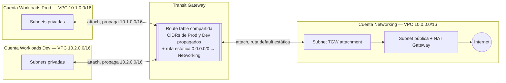

# Arquitectura de red de referencia — egress centralizado vía Transit Gateway

Diseño default para la red de un cliente nuevo en la Etapa 3: un Transit Gateway conecta la cuenta **Networking** con las cuentas **Workloads Prod** y **Workloads Dev**. Las VPCs spoke no tienen salida propia a Internet — **la salida a Internet de toda la Organization se centraliza en la VPC de la cuenta Networking** (IGW + NAT), mientras que el tráfico entre spokes (Prod ↔ Dev) viaja directo por el Transit Gateway, sin pasar por Networking. Es el patrón estándar de "egress centralizado" de AWS — no asume ningún appliance de inspección de terceros.

> **¿El cliente necesita inspección de tráfico con FortiGate?** Esta no es la variante — ver [`06-arquitectura-red-fortigate.md`](06-arquitectura-red-fortigate.md), que fuerza *todo* el tráfico (incluido spoke↔spoke) a pasar por el firewall.

Implementado con los módulos `vpc`, `transit-gateway` y `tgw-attachment` de [`terraform-modules-bgh`](../../templates/terraform-modules-bgh/) — ver el código ahí. Este documento explica el **porqué** del diseño; los módulos y sus README tienen el **cómo**.

## Por qué en Terraform y no en `network-config.yaml` de LZA

Es una decisión de dónde vive el código, no de complejidad: centralizar el ruteo del Transit Gateway en Terraform (Etapa 3) da control total y revisable por PR sobre cada route table, y mantiene unificada la forma de trabajar la red con el resto de los workloads del cliente. LZA (Etapa 2) sigue a cargo de todo lo demás: guardrails, SCPs, logging centralizado, Security Hub/GuardDuty.

## Cuentas y CIDRs

| Cuenta | VPC | CIDR | Notas |
|---|---|---|---|
| Networking | VPC de Networking | `10.0.0.0/16` | Única VPC con salida a Internet (IGW + NAT centralizado). |
| Workloads Prod | VPC Prod | `10.1.0.0/16` | Sin IGW/NAT propio. |
| Workloads Dev | VPC Dev | `10.2.0.0/16` | Sin IGW/NAT propio. Corresponde a la carpeta `envs/nonprod/` del repo de Terraform. |

**¿Para qué sirve el NAT si Networking no tiene subnets privadas?** No le da salida a una subnet privada propia (esta VPC no aloja recursos por default) — le da salida al tráfico que **llega desde Prod/Dev vía el Transit Gateway** y aterriza en la subnet de TGW attachment. Esa subnet tiene una ruta default hacia el NAT (agregada explícitamente en `envs/networking/network/main.tf`, no es automática). Si en el futuro un cliente necesita alojar algo en la cuenta Networking (ej. DNS central), ahí sí se agrega una subnet privada — el módulo `vpc` ya lo soporta, simplemente no viene por default porque hoy nada la usa.

CIDRs concretos de ejemplo (ajustar al relevamiento real del cliente, evitando overlap con el resto de la Organization):

| Cuenta | Subnet | CIDR (AZ-a / AZ-b) |
|---|---|---|
| Networking | pública (IGW/NAT) | `10.0.100.0/24` / `10.0.101.0/24` |
| Networking | TGW attachment | `10.0.252.0/28` / `10.0.252.16/28` |
| Workloads Prod | privada | `10.1.0.0/20` / `10.1.16.0/20` |
| Workloads Prod | TGW attachment | `10.1.252.0/28` / `10.1.252.16/28` |
| Workloads Dev | privada | `10.2.0.0/20` / `10.2.16.0/20` |
| Workloads Dev | TGW attachment | `10.2.252.0/28` / `10.2.252.16/28` |

## Diagrama

Versión editable: [`05-arquitectura-red-referencia.drawio`](05-arquitectura-red-referencia.drawio) — abrir en [app.diagrams.net](https://app.diagrams.net) (File → Open From → Device) o con la extensión Draw.io Integration de VS Code.

El punto clave: Prod y Dev se ven directo entre sí a través del Transit Gateway (cada uno propaga su propio CIDR a la route table compartida). Lo único que pasa por Networking es el tráfico que no matchea ningún CIDR conocido — en la práctica, todo lo que va a Internet.

## Diseño de la TGW route table

Una única route table, asociada a los tres attachments (Networking, Prod, Dev):

| Origen de la ruta | Contenido |
|---|---|
| Propagación automática desde el attachment de Prod | CIDR de Prod (`10.1.0.0/16`) |
| Propagación automática desde el attachment de Dev | CIDR de Dev (`10.2.0.0/16`) |
| Ruta estática (agregada a mano en Terraform) | `0.0.0.0/0` → attachment de Networking |

La asociación/propagación por default del Transit Gateway está deshabilitada a propósito (`default_route_table_association/propagation = disable`): cada attachment se asocia y propaga de forma explícita en el código (`modules/tgw-attachment`), nunca implícita. El attachment de Networking **no propaga nada** — no es el destino final de ningún tráfico por su propio CIDR, así que no necesita que los demás lo conozcan vía propagación; su única función en la route table es ser el blanco de la ruta estática default.

## Cómo viaja un paquete

**Prod → Internet:**
1. Sale de una subnet privada de Prod, llega a la subnet de TGW attachment de Prod.
2. TGW consulta la route table compartida → la IP destino no matchea el CIDR de Dev ni el de Prod → cae en la ruta default `0.0.0.0/0` → va al attachment de Networking.
3. Llega a la subnet de TGW attachment de Networking → ruta default de esa subnet → NAT Gateway → Internet.

**Prod → Dev (o viceversa):**
1. Sale de Prod, llega a la subnet de TGW attachment de Prod.
2. TGW consulta la route table compartida → la IP destino matchea el CIDR de Dev (propagado) → va **directo** al attachment de Dev, sin pasar por Networking.

## Orden de despliegue

1. **`envs/networking/network`** — Transit Gateway + VPC de Networking. Un solo `apply`, en la cuenta Networking.
2. Cada cuenta spoke **acepta la invitación de RAM** del Transit Gateway (ver [`transit-gateway/README.md`](../../templates/terraform-modules-bgh/modules/transit-gateway/README.md)) — paso manual, una vez por cuenta.
3. **`envs/prod/network`** y **`envs/nonprod/network`** — VPC + attachment de cada spoke, usando los IDs que salieron del paso 1 (`transit_gateway_id`, `tgw_route_table_id` en sus `terraform.tfvars`).

## Validación post-despliegue

- [ ] Transit Gateway activo, compartido con ambas cuentas spoke (`aws ram get-resource-shares`).
- [ ] Las tres cuentas (Networking, Prod, Dev) con su attachment en estado `available`, asociado a la route table compartida.
- [ ] La route table del TGW muestra los CIDRs de Prod y Dev propagados, más la ruta estática `0.0.0.0/0` hacia Networking.
- [ ] Una instancia en Prod puede alcanzar una instancia en Dev (y viceversa) directamente.
- [ ] Una instancia en Prod/Dev tiene salida a Internet únicamente a través del NAT de la cuenta Networking (confirmar con la IP pública que sale: debe ser la del NAT, no una propia).

## Registro

Documentar en `05-workloads-notes.md` del repo de instancia del cliente: CIDRs reales usados, Account IDs de Networking/Prod/Dev, y fecha del primer `apply` exitoso de cada env.

## Siguiente paso

Con la red de referencia desplegada, segui con [`04-flujo-trabajo.md`](04-flujo-trabajo.md) para el día a día de cada workload nuevo sobre esta base.
